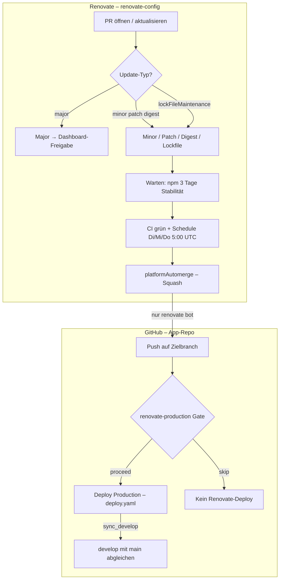
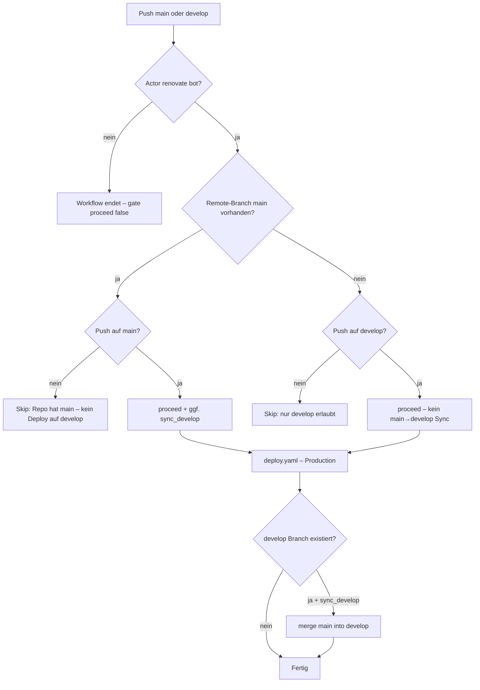
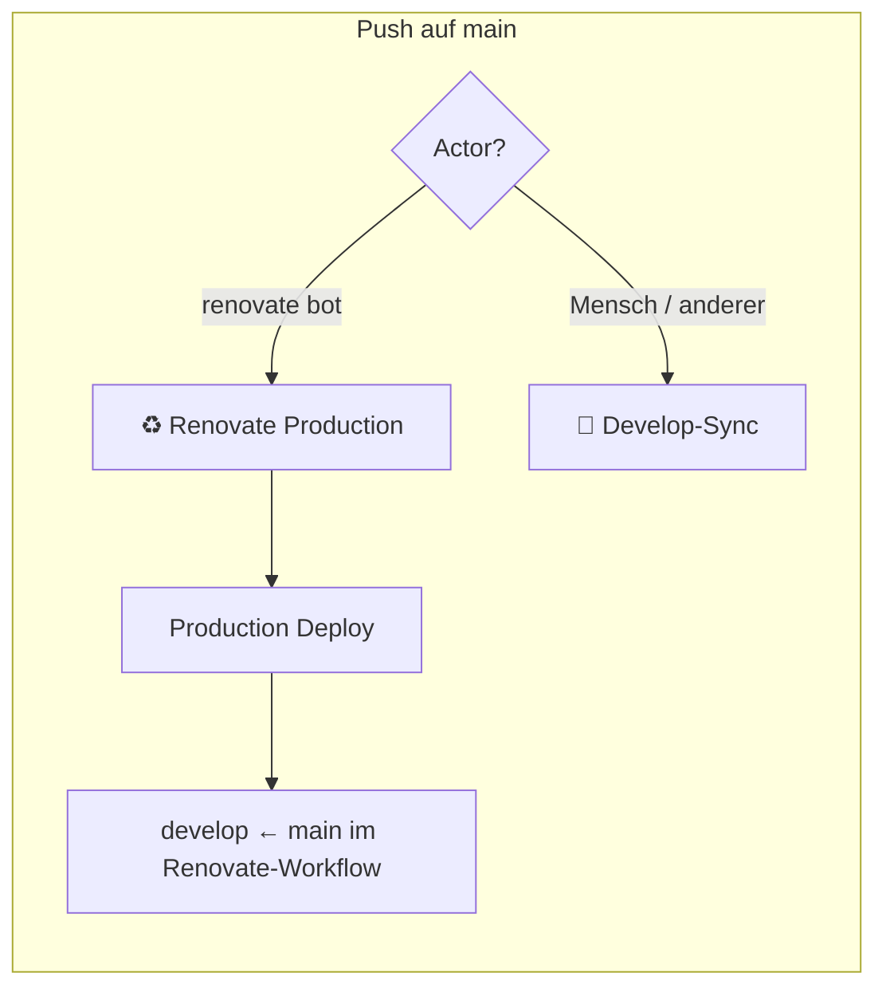
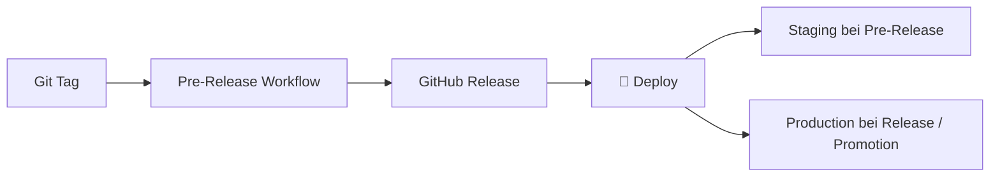

# Renovate → Production (GitFlow)

Dokumentation für die Zusammenarbeit aus **Renovate** (Shared Config), **Auto-Merge** und **GitHub Actions** (Production-Deploy ohne Tags/Releases).

**Stand:** Pilot in `[backyardultrachur.ch](https://github.com/codecrush-ch/backyardultrachur.ch)`. Org-weiter Rollout geplant; Templates liegen vorübergehend hier, später im D3-Projekt-Repo für neue Projekte.

---

## Übersicht


| Komponente                 | Repository                                                      | Zweck                                                |
| -------------------------- | --------------------------------------------------------------- | ---------------------------------------------------- |
| Renovate-Regeln            | `codecrush-ch/renovate-config` (Branch `**develop`** = Default) | PRs, Auto-Merge, Schedules                           |
| `renovate.json` im Projekt | Jeweiliges App-Repo                                             | `"extends": ["github>codecrush-ch/renovate-config"]` |
| `renovate-production.yaml` | App-Repo (optional)                                             | Nach Renovate-Merge → Production + Branch-Sync       |
| `deploy.yaml`              | App-Repo                                                        | Docker-Deploy; muss `workflow_call` unterstützen     |
| `sync-develop.yaml`        | App-Repo                                                        | `main` → `develop`, **ohne** `renovate[bot]`         |


**GitFlow-Prinzip für Renovate:** Keine Tags, keine GitHub Releases für Dependency-Updates. Production-Deploy direkt nach Merge durch `renovate[bot]`.

---

## Gesamtflow




---

## Renovate Shared Config

**Quelle:** `github>codecrush-ch/renovate-config` liest immer den **Default-Branch** → bei uns `**develop`** (nicht `main`).

### Regeln (Kurz)


| Regel                           | Verhalten                                                                                       |
| ------------------------------- | ----------------------------------------------------------------------------------------------- |
| **Major**                       | Nur mit Freigabe im Dependency Dashboard                                                        |
| **Minor, Patch, Docker-Digest** | Auto-Merge (Renovate, nicht GitHub-Queue), Squash, Di/Mi/Do-Nacht **23:00–05:59 Europe/Zurich** |
| **Lockfile Maintenance**        | Auto-Merge, gleicher Schedule                                                                   |
| **platformAutomerge**           | `false` — funktioniert ohne „Allow auto-merge“ im Repo; `automergeSchedule` wird eingehalten    |
| **npm/pnpm**                    | `minimumReleaseAge`: 3 Tage                                                                     |
| **Nuxt / Vue**                  | Kein Major über `^3` hinaus                                                                     |
| **devDependencies**             | Gebündelt (`groupName`)                                                                         |
| **Global**                      | `automerge: false`, Ausnahmen nur in `packageRules`                                             |
| **Parallel**                    | Max. 5 offene PRs                                                                               |


### Was ist ein Docker-Digest?

Ein **Digest** (`sha256:…`) pinnt ein Image exakt. Ein Digest-PR aktualisiert den Build hinter einem Tag (z. B. `:latest`), ohne den Tag-Namen zu ändern. Renovate-Typ: `digest` — seit Config-Update wie **Minor/Patch** behandelt (Auto-Merge + Schedule).

### Wann merged Renovate?

- **PR-Erstellung:** je nach Regel (npm nach 3 Tagen, Docker oft am Schedule)
- **Auto-Merge:** Di/Mi/Do-Nacht **23:00–05:59 Europe/Zurich** (`* 23 * * 2,3,4` + `* 0-5 * * 3,4,5`, Cron)
- **Config wirkt:** typisch innerhalb **1–2 h** nach Push auf `renovate-config`/`develop`

### Nacht-Fenster & Mend App

Der Cron erlaubt Updates und Auto-Merge **nur**, wenn die [Mend Renovate App](https://github.com/apps/renovate) in diesem Fenster einen Lauf startet:

- `* 23 * * 2,3,4` — Di/Mi/Do ab 23:00
- `* 0-5 * * 3,4,5` — Folgemorgen bis 05:59 (Mi/Do/Fr früh, schliesst die Nacht Fenster ab)


| Renovate-Status (Mend)                         | Typische Lauf-Frequenz |
| ---------------------------------------------- | ---------------------- |
| **activated** (≥1 Renovate-PR direkt gemerged) | ca. alle 4 h           |
| **onboarded** (noch kein direkter Merge)       | ca. 1× täglich         |


**Empfehlung:** Mindestens einen Renovate-PR direkt mergen → Status **activated** → höhere Chance auf einen Nacht-Lauf im 4-Stunden-Fenster.

`schedule` steuert **nicht**, wann Mend startet — nur was während eines Laufs passieren darf. Details: [Renovate Scheduling](https://docs.renovatebot.com/key-concepts/scheduling/), [Mend Job Scheduling](https://docs.renovatebot.com/mend-hosted/job-scheduling/).

### Voraussetzungen auf GitHub (Repo)

1. [Renovate GitHub App](https://github.com/apps/renovate) am Repo aktiv
2. **Branch protection:** required checks, falls konfiguriert (Renovate merged erst wenn grün)
3. **Allow auto-merge** im Repo ist **nicht** nötig (`platformAutomerge: false`)
4. Mend-Lauf sollte im Nacht-Fenster liegen — bei **activated** Repos statistisch wahrscheinlicher

---

## GitHub Actions: `renovate-production.yaml`

Nur in Repos mit Standard-`deploy.yaml` (Pilot: **backyardultrachur.ch**).

### Flowchart Branch-Logik




### Jobs


| Job              | Beschreibung                                                                                |
| ---------------- | ------------------------------------------------------------------------------------------- |
| **gate**         | Nur `renovate[bot]`; Branch-Policy (siehe oben)                                             |
| **deploy**       | Ruft `deploy.yaml` via `workflow_call` mit `environment: Production` auf                    |
| **sync-develop** | Nur wenn `main` existiert **und** Push auf `main` war: `git merge origin/main` in `develop` |


**Concurrency:** `renovate-production-${{ github.repository }}` — Deploys nacheinander, nicht überschneidend.

**Bei Deploy-Fehler:** `sync-develop` läuft **nicht** (`needs: deploy`).

### Manueller Test

Actions → **♻️ Renovate Production** → Branch `**main`** → `skip_actor_check: true`.

Ohne `skip_actor_check` bricht der Workflow für menschliche Actor ab (gewollt).

---

## Zusammenspiel mit `sync-develop.yaml`




| Event                                | ♻️ Renovate Production       | 🔀 Develop-Sync  |
| ------------------------------------ | ---------------------------- | ---------------- |
| `renovate[bot]` merged auf `main`    | ✅ Deploy → dann develop-Sync | ❌ ausgeschlossen |
| Mensch merged/pusht auf `main`       | ❌                            | ✅                |
| `renovate[bot]` merged auf `develop` | ❌ (wenn `main` existiert)    | ❌                |


---

## Manuell vs. Renovate-Merge


| Aktion                                  | Production via ♻️ Workflow | develop-Sync                          |
| --------------------------------------- | -------------------------- | ------------------------------------- |
| **renovate[bot]** Auto-Merge auf `main` | ✅                          | ✅ (nach Deploy, im gleichen Workflow) |
| **Du** mergest Renovate-PR manuell      | ❌                          | ✅ nur wenn Ziel `main` (Develop-Sync) |
| **Du** mergest auf `develop`            | ❌                          | ❌                                     |


Production bei manuellem Merge: **🚀 Deploy** (workflow_dispatch) oder bisheriger Release-Pfad.

---

## Wichtig: Zielbranch der Renovate-PRs

Renovate öffnet PRs standardmäßig gegen den **Default-Branch** des Repos.


| Default-Branch                  | Renovate-PRs | ♻️ Production-Workflow                   |
| ------------------------------- | ------------ | ---------------------------------------- |
| `main`                          | → `main`     | ✅ wie geplant                            |
| `develop` (z. B. backyardultra) | → `develop`  | ❌ Gate blockiert (weil `main` existiert) |


**Empfehlung** für Repos mit `main` **und** Production-Pfad über diesen Workflow:

```json
{
  "extends": ["github>codecrush-ch/renovate-config"],
  "baseBranches": ["main"]
}
```

Ohne `baseBranches` landen Updates auf `develop`; Production und `main` bleiben unberührt, bis `develop` → `main` gemerged wird.

---

## Bisheriger Release-/Deploy-Pfad (unverändert)

Für **manuelle** Releases bleibt der bestehende Weg gültig:




Renovate-Updates nutzen **diesen Pfad nicht**.

---

## Einrichtung in einem App-Repo

### 1. Renovate

```json
{
  "extends": ["github>codecrush-ch/renovate-config"],
  "baseBranches": ["main"]
}
```

(`baseBranches` nur wenn Default ≠ `main`, aber `main` für Production gewünscht.)

### 2. Workflows (Templates)


| Datei im Repo                                | Template                                                                                                        |
| -------------------------------------------- | --------------------------------------------------------------------------------------------------------------- |
| `.github/workflows/renovate-production.yaml` | `[templates/github/workflows/renovate-production.yaml](../templates/github/workflows/renovate-production.yaml)` |
| `deploy.yaml` ergänzen                       | `[deploy-workflow-call.snippet.yaml](../templates/github/workflows/deploy-workflow-call.snippet.yaml)`          |
| `sync-develop.yaml` ergänzen                 | `[sync-develop-renovate.snippet.yaml](../templates/github/workflows/sync-develop-renovate.snippet.yaml)`        |


`deploy.yaml` muss auf `**main**` liegen, bevor der Workflow produktiv genutzt wird.

### 3. Test-Checkliste

- `develop` → `main` (Workflow-Dateien auf `main`)
- Actions: **♻️ Renovate Production** auf `main`, `skip_actor_check: true`
- Production-Deploy erfolgreich
- `develop` enthält Stand von `main`
- Optional: echten Renovate-Merge abwarten (Di/Mi/Do 5:00 UTC)

---

## Rollout-Status (Org)


| Status                    | Repos                                                                                                                                  |
| ------------------------- | -------------------------------------------------------------------------------------------------------------------------------------- |
| **Pilot aktiv**           | `backyardultrachur.ch`                                                                                                                 |
| **Geplant**               | Übrige Repos mit `renovate.json` + Standard-`deploy.yaml`                                                                              |
| **Manuell / ausgenommen** | Config-Repos (`renovate-config`, …), `movermap-app`, abweichende Deploy-Workflows (`schreiner-berneroberland.ch`, `gastrostory.ch`, …) |


Templates später zusätzlich im **D3-Projekt-Repo** für neue Projekte.

---

## Typische PR-Typen


| PR-Typ                    | Renovate `updateType` | Auto-Merge (Config) | ♻️ nach Merge auf `main` |
| ------------------------- | --------------------- | ------------------- | ------------------------ |
| pnpm/npm Minor/Patch      | `minor` / `patch`     | ✅ (+ 3 Tage npm)    | ✅                        |
| Lock file maintenance     | — (eigene Sektion)    | ✅                   | ✅                        |
| Docker Tag (z. B. syntax) | `minor`               | ✅                   | ✅                        |
| Docker Digest             | `digest`              | ✅                   | ✅                        |
| Major (Nuxt, etc.)        | `major`               | ❌ Dashboard         | — (manuell)              |


---

## Fehlersuche


| Symptom                                     | Mögliche Ursache                                                                                                     |
| ------------------------------------------- | -------------------------------------------------------------------------------------------------------------------- |
| PR: „Automerge: Disabled“                   | Update-Typ nicht in Regel (z. B. Major); Config noch nicht auf `renovate-config`/`develop`                           |
| PR offen trotz „Enabled“                    | Renovate-Lauf ausserhalb „before 6am“ (Zurich); CI rot; früher `platformAutomerge: true` + `allow_auto_merge: false` |
| Merge auf `develop`, kein Production-Deploy | Gate: Repo hat `main` → `baseBranches: ["main"]` setzen                                                              |
| Merge auf `main`, kein Deploy               | Actor nicht `renovate[bot]` (manueller Merge)                                                                        |
| Develop-Sync doppelt                        | Soll nicht vorkommen: `sync-develop` skippt `renovate[bot]`                                                          |
| Config-Änderung nicht aktiv                 | `renovate-config` auf Default-Branch `develop` pushen; 1–2 h warten                                                  |


---

## Referenzen

- [Renovate Docs](https://docs.renovatebot.com/)
- [Renovate minimumReleaseAge](https://docs.renovatebot.com/key-concepts/minimum-release-age/)
- [GitHub Reusable Workflows](https://docs.github.com/en/actions/using-workflows/reusing-workflows)
- [Renovate GitHub App](https://github.com/apps/renovate)

